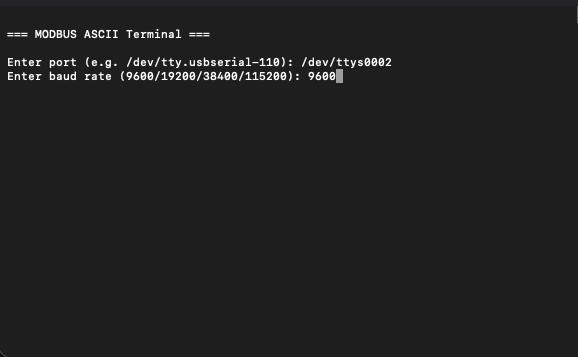
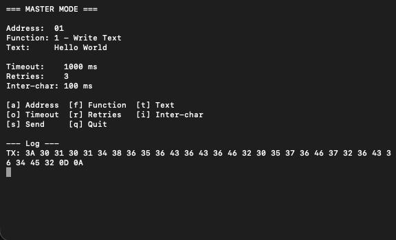
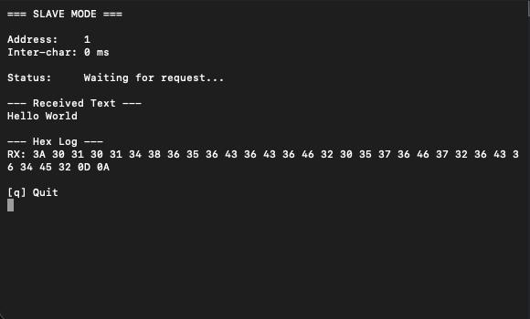

# modbus-ascii

A terminal application implementing MODBUS ASCII protocol communication over RS-232 serial links. Supports Master and Slave station modes with a full ncurses-based TUI.



---

## Features

- **MODBUS ASCII** frame building and parsing with automatic LRC checksum calculation
- **Master mode** — addressed and broadcast transactions, configurable timeouts and retransmissions
- **Slave mode** — state machine frame reception, address verification, command execution
- **Two application-layer commands:**
  - Command `01` — send text from Master to Slave (addressed and broadcast)
  - Command `02` — read text from Slave to Master (addressed only)
- **Hex dump** of sent and received frames in both modes
- **ncurses TUI** — real-time display, configurable parameters, scrolling log
- **Graceful shutdown** — Slave exits cleanly on `q` without blocking

---

## Requirements

- macOS (tested on Apple Silicon)
- Xcode Command Line Tools (provides `ncurses` and `clang++`)
- CMake 3.16+
- Two USB-to-RS232 adapters and a null-modem cable for hardware testing
- `socat` for virtual port testing: `brew install socat`

---

## Build

```bash
git clone https://github.com/Tomasz3wski/modbus-ascii.git
cd modbus-ascii
mkdir build && cd build
cmake ..
make
```

---

## Usage

```bash
./modbus-ascii
```

On startup the application asks for the serial port and baud rate, then prompts for mode selection.

### Finding your serial port

```bash
ls /dev/tty.*
```

Look for a device like `/dev/tty.usbserial-110`.

### Master mode



| Key | Action                                              |
| --- | --------------------------------------------------- |
| `a` | Set destination address (hex)                       |
| `f` | Toggle function: Write Text / Read Text             |
| `t` | Set text to send                                    |
| `o` | Set transaction timeout (0–10000 ms, step 100 ms)   |
| `r` | Set retry count (0–5)                               |
| `i` | Set inter-character timeout (0–1000 ms, step 10 ms) |
| `s` | Send transaction                                    |
| `q` | Quit                                                |

### Slave mode



On startup, Slave asks for:

- Station address (1–247)
- Inter-character timeout (0–1000 ms)

The panel displays the received text and a hex log of incoming frames. Press `q` to stop.

---

## Protocol Details

MODBUS ASCII frames have the following structure:

```
: [ADR] [FUNC] [DATA...] [LRC] CR LF
```

- `:` — start of frame
- `ADR` — 2 hex chars, station address (`00` = broadcast)
- `FUNC` — 2 hex chars, function code
- `DATA` — variable length, each byte encoded as 2 hex chars
- `LRC` — Longitudinal Redundancy Check, 2 hex chars
- `CR LF` — end of frame

### LRC Calculation

The LRC is computed over address, function, and data bytes:

```
sum = (address + function + data bytes) mod 256
LRC = (~sum + 1) & 0xFF
```

Verification: sum of all bytes including LRC equals `0x00`.

### Implemented Commands

| Code | Name       | Direction      | Broadcast |
| ---- | ---------- | -------------- | --------- |
| `01` | Write Text | Master → Slave | Yes       |
| `02` | Read Text  | Master ← Slave | No        |

---

## Testing with socat

To test without hardware, create a pair of virtual serial ports:

```bash
socat -d -d pty,raw,echo=0 pty,raw,echo=0
```

Note the two port names (e.g. `/dev/ttys004` and `/dev/ttys005`) and run two instances of the application — one as Master, one as Slave — each using one of the virtual ports.

---

## Project Structure

```
modbus-ascii/
├── src/
│   ├── main.cpp
│   ├── modbus/
│   │   ├── LRC.hpp / LRC.cpp        # LRC checksum
│   │   ├── Frame.hpp / Frame.cpp    # Frame building and parsing
│   │   ├── Master.hpp / Master.cpp  # Master station logic
│   │   └── Slave.hpp / Slave.cpp    # Slave station logic
│   ├── serial/
│   │   └── SerialPort.hpp / .cpp    # POSIX serial port wrapper
│   └── ui/
│       └── UI.hpp / UI.cpp          # ncurses TUI
└── CMakeLists.txt
```
